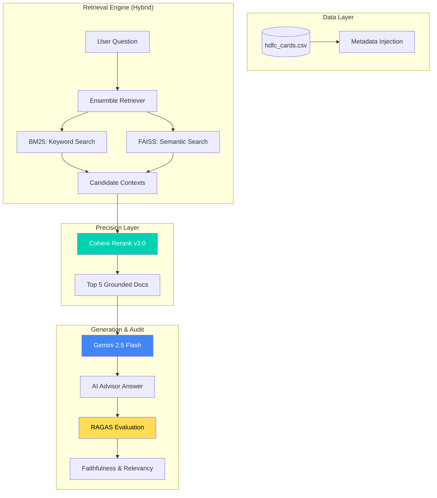

# HDFC Credit Card Advisor: Advanced RAG System

An enterprise-grade Retrieval-Augmented Generation (RAG) system built to provide high-precision comparisons and feature analysis for HDFC Credit Cards. This project utilizes a hybrid retrieval architecture, cross-encoder reranking, and automated quality auditing.

---

## Architecture Overview

The system follows a multi-stage pipeline designed for financial accuracy and zero-hallucination.

### 1. Data Ingestion & Enrichment

- **Source:** `data/hdfc_cards.csv` containing card names and features.
- **Enrichment:** Metadata is injected directly into the page content (e.g., `Card: [Name]. Features: [Text]`) to ensure the retriever never loses context of the specific product.
- **Chunking:** Recursive character splitting optimized for 800-character context windows.

### 2. Hybrid Retrieval Engine

To balance speed and semantic depth, the system employs an **Ensemble Retriever**:

- **BM25 (40% Weight):** Best-in-class keyword matching for specific card names (e.g., "Regalia Gold").
- **FAISS + Gemini Embeddings (60% Weight):** Vector-based semantic search to understand intent (e.g., "travel benefits").

### 3. Precision Reranking

- **Model:** `Cohere Rerank v3.0`
- **Function:** Acts as a 'Senior Judge' that re-evaluates the top 10 candidates from the Hybrid Engine, selecting only the top 5 most relevant snippets to pass to the LLM.

### 4. Generation & Grounding

- **LLM:** `Gemini 2.5 Flash`
- **Zero-Hallucination:** The model is strictly constrained to the retrieved context. If information is missing, it explicitly states it cannot answer.

### 5. Automated Quality Audit (RAGAS)

The system self-evaluates every response using the RAGAS framework:

- **Faithfulness:** Verifies the answer is logically derived ONLY from the retrieved context.
- **Answer Relevancy:** Measures how well the response addresses the user's specific query.

---

## Architecture Diagram



---

## Technical Stack

| Component | Technology |
| :--- | :--- |
| **Orchestration** | LangChain 0.3+ |
| **LLM** | Google Gemini 2.5 Flash |
| **Embeddings** | Google Gemini 2.0 Preview |
| **Reranker** | Cohere Rerank v3.0 |
| **Vector Store** | FAISS |
| **UI Framework** | Streamlit |
| **Evaluation** | RAGAS Framework |

---

## Getting Started

### Prerequisites

- Python 3.9 - 3.11
- API Keys for Google Gemini and Cohere

### Installation

1. Clone the repository:

   ```bash
   git clone https://github.com/imyasars/HDFC_CC_RAG.git
   cd hdfc-rag-advisor
   ```

2. Create an isolated environment:

   ```bash
   python3 -m venv hdfc_env
   source hdfc_env/bin/activate
   ```

3. Install dependencies:

   ```bash
   pip install -r requirements.txt
   ```

4. Set your API keys in a `.env` file:

   ```
   GOOGLE_API_KEY=your_gemini_key
   COHERE_API_KEY=your_cohere_key
   ```

5. Run the application:

   ```bash
   python -m streamlit run streamlit_app.py
   ```

---

## Technical Evaluations (The "12 vs 8" Case)

The system is validated using high-precision queries. For example, comparing Regalia Gold and Millennia lounge access:

- **Millennia:** 8 domestic visits.
- **Regalia Gold:** 12 domestic + 6 international visits.

The system consistently achieves a **Faithfulness Score of 1.0**, proving that its numerical comparisons are 100% grounded in the provided CSV data.
